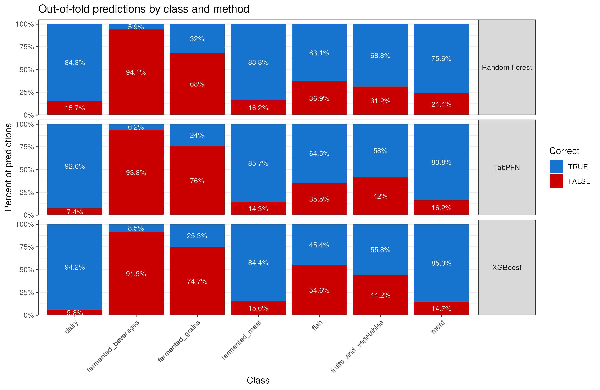
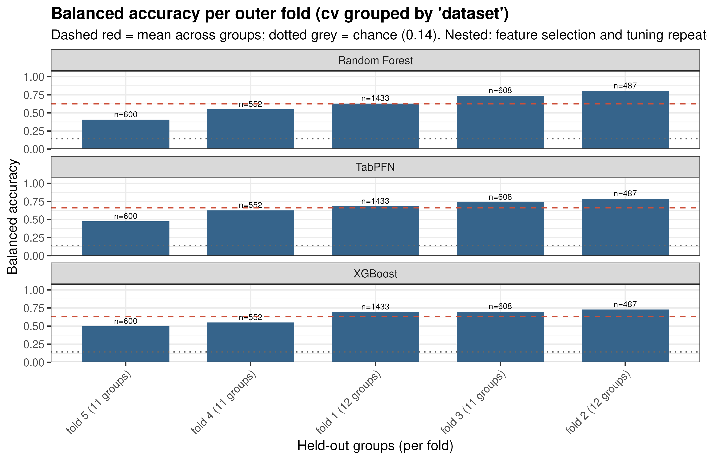
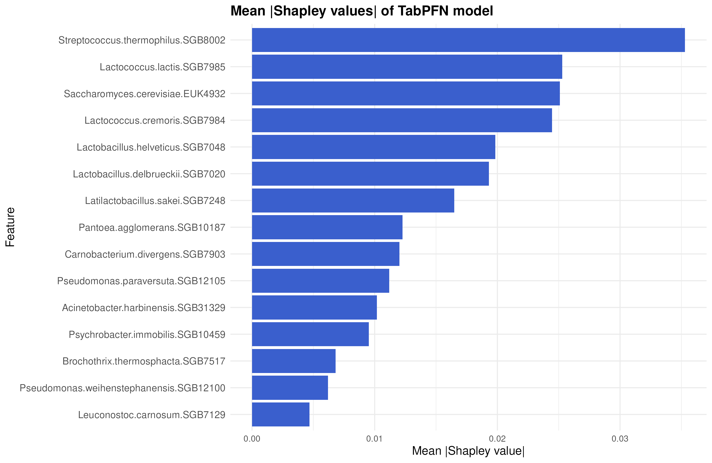
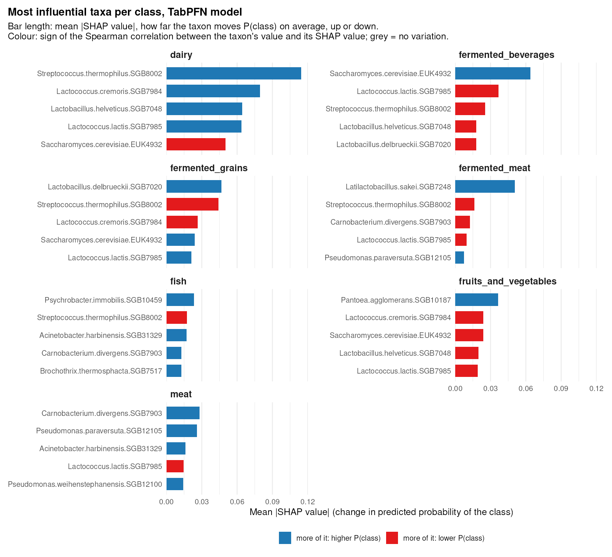

# Results

SGB level, nested, three learners: TabPFN 3.5, a random forest and XGBoost.
Every number below comes from the run's own `metrics/` files, and the shipped
`config_cfmd_category.yaml` reproduces it.
This is the full analysis. The container's default demo is a small slice of it and does
not score like it.

## Which food: seven categories, grouped cross-validation

!!! abstract "The run"

    3,680 samples · 57 datasets · 7 food categories · SGB level ·
    5 grouped CV folds · nested · no class balancing · no calibration · 1 h 37 min

Mean over the five outer folds, ± the standard deviation across them:

| | balanced accuracy | accuracy | log-loss |
|---|---:|---:|---:|
| TabPFN | 0.662 ± 0.121 | 0.801 ± 0.071 | 0.572 ± 0.118 |
| Random forest | 0.626 ± 0.157 | 0.743 ± 0.079 | 0.677 ± 0.163 |
| XGBoost | 0.634 ± 0.103 | 0.801 ± 0.061 | 0.565 ± 0.177 |

- **Read the balanced-accuracy column.** Dairy is 2,467 of the 3,680 samples, so
  answering "dairy" to everything scores 0.67 accuracy. Balanced accuracy weights the
  seven categories equally; its chance level is 1/7 = 0.143.
- **One decision rule for all three.** The predicted category is the one with the
  largest probability divided by that category's frequency in the fold's training samples
  ([which category is predicted](../workflow/evaluation.md#which-category-is-predicted)).
  Log-loss uses the probabilities unchanged.
- **No ranking.** The three means are 0.036 apart; the fold-to-fold standard deviation is
  0.10–0.16. [Comparing learners](comparison.md) has the detail.

### Per category

Pooled out-of-fold recall, from `metrics/per_class_recall_oof.csv`:

| class | n | TabPFN | random forest | XGBoost | TabPFN mistakes it for |
|---|---:|---:|---:|---:|---|
| `dairy` | 2467 | 0.926 | 0.843 | 0.942 | fermented_grains, fruits_and_vegetables |
| `fermented_meat` | 154 | 0.857 | 0.838 | 0.844 | meat, dairy |
| `meat` | 197 | 0.838 | 0.756 | 0.853 | fermented_meat, fermented_grains |
| `fish` | 141 | 0.645 | 0.631 | 0.454 | meat, fruits_and_vegetables |
| `fruits_and_vegetables` | 224 | 0.580 | 0.688 | 0.558 | fermented_grains, fermented_meat |
| `fermented_grains` | 75 | 0.240 | 0.320 | 0.253 | fermented_beverages, dairy |
| `fermented_beverages` | 422 | 0.062 | 0.059 | 0.085 | fermented_grains, fruits_and_vegetables |
| **mean (pooled)** | 3680 | **0.593** | **0.591** | **0.570** | |

The mean of a recall column is balanced accuracy over the pooled predictions. It is lower
than the fold average above (0.593 against 0.662 for TabPFN): the folds differ in size
(1,433 / 487 / 608 / 552 / 600 samples), and each fold's balanced accuracy averages only
the categories present in its test set.



!!! warning "`fermented_beverages`: one dataset decides the row"

    375 of the 422 samples come from one dataset, held out in fold 1. The training part
    of that fold has 47 `fermented_beverages` samples, from three other datasets. All
    three learners assign most of the held-out dataset to `fermented_grains`: TabPFN 323
    of 375, the forest 326, XGBoost 343. With the largest probability as the rule the
    counts are 315, 308 and 237, the rest going mostly to dairy. The error is in the
    probabilities, not in the decision rule. The row measures transfer from three small
    studies to one large one.

- **`fermented_grains`**: 75 samples in three datasets (40, 30 and 5), each held out in
  a different fold (4, 2 and 5). Recall 0.24–0.32. The learners emit the label 529–600
  times, 18–24 of them correctly; most of the others are the `fermented_beverages`
  dataset above.
- **Where the learners differ by more than 0.1**: `dairy` (forest 0.843, the others
  0.93–0.94), `fish` (XGBoost 0.454, the others 0.63–0.65) and `fruits_and_vegetables`
  (forest 0.688, the others 0.56–0.58).
- **Confusions** follow substrate and flora: `meat` and `fermented_meat` with each other,
  `fish` with `meat`, `fermented_grains` with `fermented_beverages`.

### Per fold



| fold | n test | TabPFN | random forest | XGBoost |
|---|---:|---:|---:|---:|
| 1 | 1433 | 0.682 | 0.630 | 0.694 |
| 2 | 487 | 0.788 | 0.805 | 0.728 |
| 3 | 608 | 0.739 | 0.737 | 0.701 |
| 4 | 552 | 0.626 | 0.550 | 0.549 |
| 5 | 600 | 0.475 | 0.406 | 0.498 |

- No learner is ahead in every fold.
- Within a fold the three are at most 0.09 apart. Across folds each spans 0.23–0.40.
- Each fold holds out 11 or 12 whole datasets; which datasets land together decides much
  of the score. Fold 5's test set is 521 dairy samples out of 600, with five
  `fermented_grains` and nine `meat`, so its balanced accuracy averages over categories
  with almost no samples.
- Quote the mean with the spread beside it.

### Which taxa

Selection is nested: it runs inside every outer fold, on that fold's training part alone,
over the full table of 7,847 SGBs. It keeps a different number each time: 125, 100, 550,
125 and 80 SGBs across the five folds. The 15 SGBs in `metrics/selected_features.csv` are
the final model's selection, fitted on all the training data.

SHAP is computed for TabPFN, the learner with the highest cross-validated balanced
accuracy, refitted on those 15 SGBs, over 100 training samples
(`importance.tabpfn_shap_max_rows`).



| taxon | mean \|SHAP\| |
|---|---:|
| *Streptococcus thermophilus* | 0.035 |
| *Lactococcus lactis* | 0.025 |
| *Saccharomyces cerevisiae* | 0.025 |
| *Lactococcus cremoris* | 0.024 |
| *Lactobacillus helveticus* | 0.020 |
| *Lactobacillus delbrueckii* | 0.019 |
| *Latilactobacillus sakei* | 0.016 |
| *Pantoea agglomerans* | 0.012 |

The global ranking does not say which category a taxon speaks for. Per category, the
taxa that move its predicted probability most:



Bar length is the mean |SHAP value| for that category. Colour is the sign of the
Spearman correlation between the taxon's value and its SHAP value (`direction_rho` in
`metrics/shap_class_contributions.csv`): blue, more of the taxon raises the category's
probability; red, it lowers it. The figure is the notebook's `importance_by_class`,
drawn from this run's saved SHAP values.

| category | more of it raises P(category) | more of it lowers P(category) |
|---|---|---|
| `dairy` | *S. thermophilus*, *L. cremoris*, *L. helveticus*, *L. lactis* | *S. cerevisiae* |
| `fermented_beverages` | *S. cerevisiae* | *L. lactis*, *S. thermophilus*, *L. helveticus*, *L. delbrueckii* |
| `fermented_grains` | *L. delbrueckii*, *S. cerevisiae*, *L. lactis* | *S. thermophilus*, *L. cremoris* |
| `fermented_meat` | *L. sakei*, *Pseudomonas paraversuta* | *S. thermophilus* |
| `fish` | *Psychrobacter immobilis*, *Acinetobacter harbinensis*, *Carnobacterium divergens* | *S. thermophilus* |
| `fruits_and_vegetables` | *Pantoea agglomerans* | *L. cremoris*, *S. cerevisiae*, *L. helveticus*, *L. lactis* |
| `meat` | *C. divergens*, *P. paraversuta*, *A. harbinensis*, *Pseudomonas weihenstephanensis* | *L. lactis* |

- The table lists each category's top five taxa by mean |SHAP value|, except three
  whose correlation is below 0.3 in absolute value (*C. divergens* and *L. lactis* for
  `fermented_meat`, *Brochothrix thermosphacta* for `fish`): their SHAP values do not
  follow their abundance in one direction.
- The dairy starter bacteria (*S. thermophilus*, the *Lactococcus* species,
  *L. helveticus*) count for dairy and against most other categories.
- Each other category has its own marker: *S. cerevisiae* for fermented beverages,
  *L. delbrueckii* for fermented grains, *L. sakei* for fermented meat,
  *P. agglomerans* for fruits and vegetables, *P. immobilis* for fish, *C. divergens*
  and *P. paraversuta* for meat.
- The SGB table carries eukaryotic bins (`EUK` ids) alongside the bacterial ones, hence
  the yeast.

### What the run cost

From `metrics/timings.csv`:

| learner | tuning, summed over the 5 outer folds | final model |
|---|---:|---:|
| TabPFN | 11.1 min | 2.0 min |
| Random forest | 10.1 min | 1.6 min |
| XGBoost | 10.8 min | 1.8 min |

- Per fold: 1.6–2.2 min per learner, except fold 3 (2.7 / 3.5 / 2.7 min), whose
  selection kept 550 SGBs.
- The final model is tuned once on all the training data, before the outer folds run.
- TabPFN is not trained: the training table is passed as context at prediction time, so
  its tuning time is the cost of evaluating one fixed setting across the inner
  resampling.

| stage | wall clock |
|---|---:|
| start-up, import, preprocessing, final selection | 2.7 min |
| final models, three learners | 5.3 min |
| outer loop: per-fold selection, tuning (32 min) and scoring | 37.5 min |
| SHAP and the report | 51.2 min |
| **total** | **1 h 37 min** |

### Reproducing it

```bash
mkdir -p out ~/.cache/tabpfn
docker run --rm --gpus all --user "$(id -u):$(id -g)" -e TABPFN_TOKEN \
  -v "$HOME/.cache/tabpfn:/work/.cache/tabpfn" -v "$PWD/out:/work/out" \
  ghcr.io/ilivius/tabflux:1.6.0 Rscript scripts/run_multi_tax_levels.R config_cfmd_category.yaml
```

About 1 h 37 min on a 16-core Threadripper with one RTX 4090. Only TabPFN uses the card;
the forest, XGBoost, the feature selection and the SHAP pass are CPU work, so the rows of
the timing tables scale with different hardware.

The figures on this page are written by the run itself, at print resolution, into
`figures/` next to `metrics/`, as PNG and SVG both.
The across-level summary lands in
`<date>_<id>_<version>_multi_tax_results/lodo_metrics_all_tax_levels.png` (and `.svg`).
