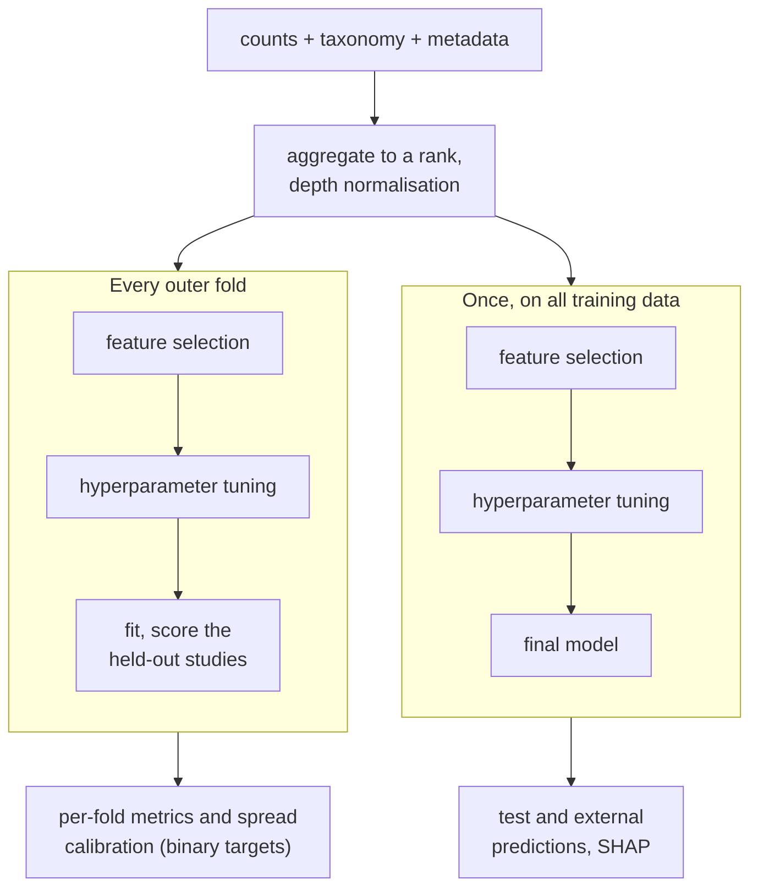

# Overview

TabFlux is an [R](https://www.r-project.org) and [Quarto](https://quarto.org) workflow,
built on [mlr3](https://mlr3.mlr-org.com), that turns tabular microbiome data (taxon
counts or relative abundances per sample) into a classifier and into an
*honest estimate of what that classifier is worth on data it has never seen*. It aggregates taxa to any rank, corrects for sequencing depth, selects
features, tunes hyperparameters, evaluates by nested resampling that keeps whole studies
together — leave-one-dataset-out or grouped cross-validation — calibrates its
probabilities on binary targets and explains its decisions. A single plain-text
configuration file drives all of it. This site documents version **v1.6.0**.

TabFlux belongs to the [BioFlux](https://github.com/stars/iLivius/lists/bioflux)
family of pipelines.

!!! abstract "Terms used on this page"

    | | |
    |---|---|
    | **ASV** | amplicon sequence variant — the finest unit of an amplicon dataset, defined by its exact sequence |
    | **SGB** | species-level genome bin — the deepest unit MetaPhlAn 4 reports for shotgun data, written `t__SGB7985` in a lineage |
    | **Grouped CV** | folds drawn over whole studies, so no study is split between training and test and the test samples come from studies the model never saw |
    | **LODO** | leave-one-dataset-out — one fold per study; the extreme case of grouped cross-validation |
    | **Nested** | feature selection and tuning are repeated *inside* each fold, not once beforehand |
    | **SHAP** | a per-sample decomposition of a prediction into one contribution per taxon |

## The problem it is built for

Microbiome classifiers are usually reported with random cross-validation, where each
test sample has neighbours from the same study in the training set. The model can then
recognise the study rather than the biology, and the score flatters: it measures how well
the model does on more samples from studies it has already seen, not on a new study.
Holding whole studies out of training, and repeating feature selection and tuning inside
every fold, measures the model on studies it has never seen. TabFlux was written for an unpublished multi-site
amplicon study; the public [cFMD case study](cfmd/index.md) shows it on food
metagenomes.

## What a run does

The left column is repeated for every outer fold, whether that fold holds out one dataset
or a block of them; its scores are the estimate. The right column runs once and gives the
model that predicts new samples and is explained. That is what the honest estimate costs;
the [evaluation design](workflow/evaluation.md) page explains the trade.

## Two learners

**Random forest** (`ranger`), the standard baseline of microbiome classification.

**TabPFN**, a transformer pre-trained on synthetic tables; TabFlux uses the TabPFN-3.5
checkpoint by default. Its weights are not updated on your data: the training samples
are passed in as context at prediction time, and each prediction averages eight forward
passes, each over a slightly altered copy of the table.

The template configuration picks both; the [learners](workflow/learners.md) page lists the others. On the
cFMD case study, with one decision rule for every learner, balanced accuracy is 0.66 ± 0.12
for TabPFN, 0.63 ± 0.16 for the forest and 0.63 ± 0.10 for XGBoost: differences smaller
than the spread across folds ([comparing learners](cfmd/comparison.md)).

## Where to go next

- [Introduction](introduction.md) — microbial tables, the evaluation problem, where TabPFN fits.
- [Rationale](rationale.md) — why the workflow is shaped this way.
- [Installation](getting-started/installation.md) — the container, or conda.
- [Quick start](getting-started/quick-start.md) — a public dataset, one command.
- [Case study](cfmd/index.md) — about 4,000 food metagenomes, no local data needed.
