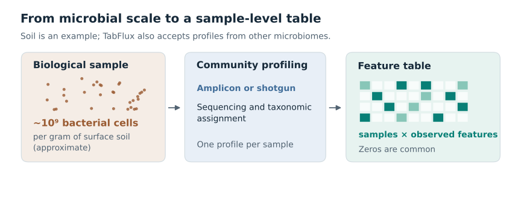
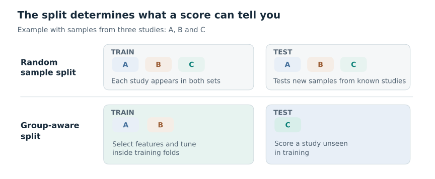
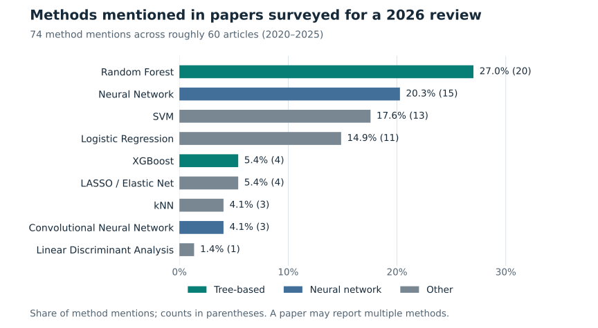

# Why TabFlux

## From a microbial community to a feature table

A gram of surface soil can contain on the order of a billion bacterial cells [1]. A
classifier sees none of those cells or their genomes. Amplicon sequencing and shotgun
taxonomic profiling reduce each sample to a vector of observed microbial features, such as
amplicon sequence variants (ASVs) or species-level genome bins (SGBs). Across samples, the
resulting table is often sparse and has many features relative to its number of samples.
Read counts depend on sequencing depth; normalised abundances are compositional, and a
zero can mean absence or non-detection [2,3].

*Figure 1. Profiling compresses a complex community into one feature vector per sample.*

## The evaluation problem

Machine learning has long been used to analyse human microbiome profiles, including
associations with disease [4]. It is also applied to plant-associated and agricultural
microbiomes [3,7], and public resources such as cFMD provide profiles of food
metagenomes [5]. In each setting, samples may come from different studies, sites or
sequencing batches. A random split can put samples from the same group in both training
and test sets. If group-specific patterns correlate with the target, the resulting score
may overstate performance on a new group [6].

*Figure 2. Schematic comparison of two evaluation questions. For transfer to a new study
or site, the test set must contain whole groups unseen during training. Feature selection
and tuning belong inside the training portion of each outer split. Grouping alone cannot
remove biological or technical confounding.*

While preparing a review of machine learning for designing low-risk microbial consortia
pesticides [7], its authors tallied the methods mentioned in roughly 60 agricultural and
environmental microbiome papers published in 2020–2025, and recorded 74 method mentions.
The random forest was the most frequent individual method (20/74 mentions); random forest
and XGBoost together accounted for 24/74. Neural networks, including convolutional
networks, accounted for 18/74.

*Figure 3. Methods mentioned in the papers surveyed for Garcés-Ruiz et al. [7].*

## Where TabPFN fits

TabPFN is a different type of learner. The version described by Hollmann and colleagues in
*Nature* in 2025 was trained on synthetic tabular prediction tasks and uses a transformer
to condition on labelled examples at inference [8]. Prior Labs released TabPFN-3.5 in
2026 [9]; its model card states that it is trained purely on synthetic tabular tasks and
predicts in a forward pass [10]. TabFlux averages eight such passes per prediction, the
number stored in the checkpoint, and a nested evaluation still calls the learner for
every inner and outer fold. TabFlux uses the TabPFN-3.5 checkpoint by default; v2.5 is
selectable through `runtime.tabpfn.model_version`. Its performance on microbial profiles
has to be established on the same held-out groups, and with the same metrics, as the
other learners in a run.

## What the workflow does

**TabFlux is an R/mlr3 workflow for classification from existing microbial community
tables.** It reads a feature table (read counts, or relative abundances such as MetaPhlAn
profiles), a taxonomy table and sample metadata from amplicon or shotgun profiling. A YAML
configuration names the outcome and, when applicable, the study, site or batch to hold
together during evaluation. The workflow aggregates taxa to a chosen rank, normalises for
sequencing depth and selects features. It offers seven learners: TabPFN, random forest,
XGBoost, penalised regression, k-nearest neighbours, a support vector machine and a
multilayer perceptron; the multilayer perceptron cannot share a run with TabPFN.

Evaluation is nested by default: feature selection and hyperparameter tuning are repeated
on the training portion of each outer fold. When the configuration names a grouping
column, as the template and the cFMD examples do, each outer fold holds out whole groups;
without one, the folds are random and stratified by class. An independent external test
set can also be supplied.

The report gives accuracy, balanced accuracy and log-loss, with ROC-AUC, PR-AUC and
related measures for binary targets, plus recall for each class, predictions and the
selected features. By default the predicted class is the one with the largest probability
divided by that class's frequency in the training samples, the rule that favours balanced
accuracy; log-loss uses the unadjusted probabilities (see
[evaluation design](workflow/evaluation.md#which-category-is-predicted)). SHAP values, per
taxon and per class, are computed for the learner with the highest cross-validated
balanced accuracy, refitted on all training samples, on a subset of those samples; the
report summarises them and `metrics/shap_values.csv` holds the per-sample values.

A worked example uses food metagenome profiles from the public
[cFMD resource](https://github.com/SegataLab/cFMD) [5]. TabFlux starts from profiles
rather than raw reads. For user-supplied data, a run needs one configuration file and
three input tables, plus three more for an optional external test set; the Quarto
workflow produces an HTML report with machine-readable results.

!!! note "Model licence"

    TabFlux (Apache-2.0), the `tabpfn` Python package it calls (Apache-2.0, Prior Labs)
    and the TabPFN-3.5 weights are licensed separately. The weights are downloaded from
    Prior Labs' `tabpfn_3_5` repository after a one-time licence acceptance and are
    distributed under the TabPFN-3.5 License v1.0 [10]. It allows testing, evaluation and
    non-commercial research, including internal benchmarking. It excludes commercial,
    production, military, surveillance and biometric uses. The non-commercial condition
    covers the model, its derivatives and its outputs (predictions, probabilities,
    explanations); commercial or production use needs a separate licence from Prior Labs.
    Check the current terms before using this learner in another setting.

## References

1. Delmont TO, et al. (2015). Reconstructing rare soil microbial genomes using in situ
   enrichments and metagenomics. *Frontiers in Microbiology* 6:358.
   <https://doi.org/10.3389/fmicb.2015.00358>
2. Gloor GB, Macklaim JM, Pawlowsky-Glahn V, Egozcue JJ (2017). Microbiome datasets are
   compositional: and this is not optional. *Frontiers in Microbiology* 8:2224.
   <https://doi.org/10.3389/fmicb.2017.02224>
3. Busato S, et al. (2023). Compositionality, sparsity, spurious heterogeneity, and other
   data-driven challenges for machine learning algorithms within plant microbiome
   studies. *Current Opinion in Plant Biology* 71:102326.
   <https://doi.org/10.1016/j.pbi.2022.102326>
4. Pasolli E, Truong DT, Malik F, Waldron L, Segata N (2016). Machine learning
   meta-analysis of large metagenomic datasets: tools and biological insights. *PLOS
   Computational Biology* 12(7):e1004977. <https://doi.org/10.1371/journal.pcbi.1004977>
5. Carlino N, Blanco-Míguez A, Punčochář M, et al. (2024). Unexplored microbial diversity
   from 2,500 food metagenomes and links with the human microbiome. *Cell*
   187(20):5775–5795. <https://doi.org/10.1016/j.cell.2024.07.039>
6. Wirbel J, et al. (2021). Microbiome meta-analysis and cross-disease comparison enabled
   by the SIAMCAT machine learning toolbox. *Genome Biology* 22:93.
   <https://doi.org/10.1186/s13059-021-02306-1>
7. Garcés-Ruiz M, Guijarro Díaz-Otero B, Antonielli L, et al. (2026). Machine learning for
   designing low-risk microbial consortia pesticides. *Trends in Biotechnology*
   44(9):2596–2610. <https://doi.org/10.1016/j.tibtech.2025.12.027>
8. Hollmann N, Müller S, Purucker L, Krishnakumar A, Körfer M, Hoo SB, Schirrmeister RT,
   Hutter F (2025). Accurate predictions on small data with a tabular foundation model.
   *Nature* 637:319–326. <https://doi.org/10.1038/s41586-024-08328-6>
9. Jäger B, et al. (2026). TabPFN-3.5: technical report. arXiv:2609.17895.
   <https://arxiv.org/abs/2609.17895>
10. Prior Labs (2026). TabPFN-3.5 model card <https://huggingface.co/Prior-Labs/tabpfn_3_5>
    and TabPFN-3.5 License v1.0
    <https://huggingface.co/Prior-Labs/tabpfn_3_5/blob/main/LICENSE>, accessed
    September 2026.
